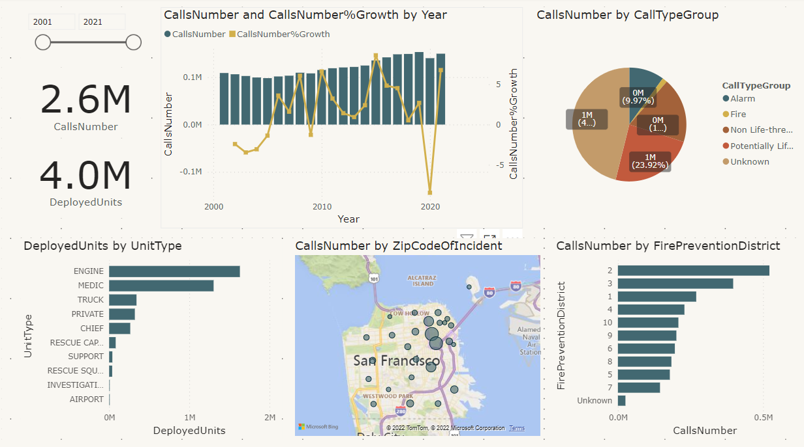
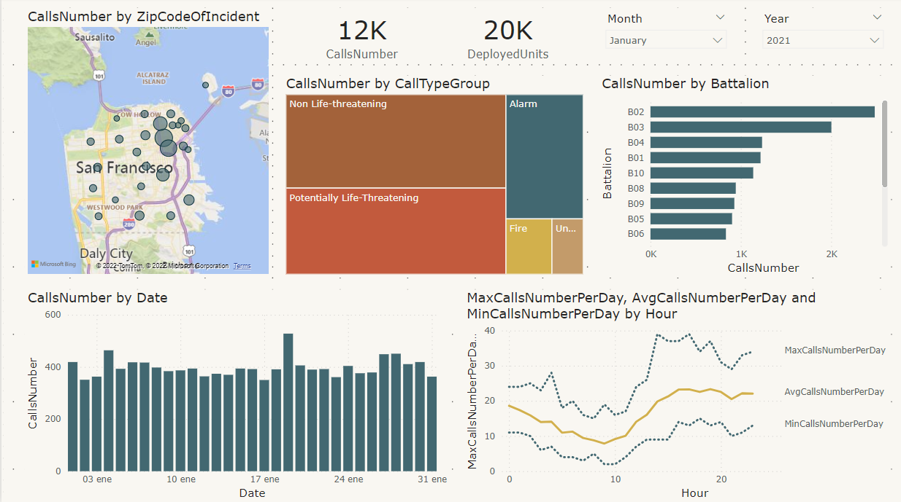
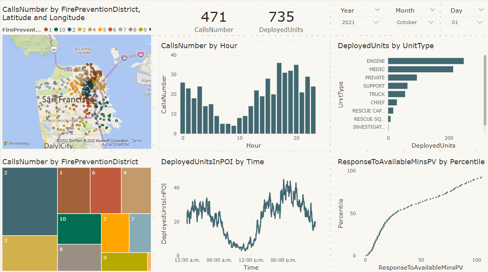

# Fire Department Calls Dashboard

In this project, a dashboard for the Fire Department Calls dataset is implemented. The data preparation and modelling steps are done using Apache Spark 3 and the report is developed using Power BI.

The Fire Department Calls dataset contains information about fire emergency calls and the units deployed to respond to the emergency.
The dataset and the data dictionary can be found in the following link:
[Fire-Department-Calls-for-Service](https://data.sfgov.org/Public-Safety/Fire-Department-Calls-for-Service/nuek-vuh3).

Each call has the following attributes:

- **CallNumber**: A unique 9-digit number assigned by the 911 Dispatch Center (DEM) to this call
- **ReceivedDtTm**: Date and time of call is received at the 911 Dispatch Center
- **Priority**: Call priority (Code 2: Non-Emergency or Code 3:Emergency)
- **CallType**: Type of call the incident falls into
- **CallTypeGroup**: Call types are divided into four main groups: Fire, Alarm, Potential Life Threatening and Non Life Threatening
- **Battalion**: Emergency Response District (There are 9 Fire Emergency Response Districts)
- **StationArea**: Fire Station First Response Area associated with the address of the incident
- **City**: City of incident
- **ZipcodeOfIncident**: Zipcode of incident
- **Address**: Address of mid-block point associated with incident (obfuscated address to protect caller privacy)
- **Box**: Fire box associated with the address of the incident. A box is the smallest area used to divide the City
- **AnalysisNeighbourhood**: Neighborhood District associated with the address
- **FirePreventionDistrict**: Bureau of Fire Prevention District associated with the address
- **SupervisorDistrict**: Supervisor District associated with the address
- **Latitude**: Latitude of address obfuscated either to the mid-block, intersection or call box
- **Longitude**: Longitude of address obfuscated either to the mid-block, intersection or call box

Each unit has the following attributes:

- **UnitType**: Type of the unit.

Each call is dispatched to multiple units. For each dispatched unit the following attributes are provided:

- **ALSUnit**: Does this unit includes ALS (Advance Life Support) resources? Is there a paramedic in this unit?
- **DispatchDtTm**: Date and time the 911 operator dispatches this unit to the call.
- **ResponseDtTm**: Date and time this unit acknowledges the dispatch and records that the unit is en route to the location of the call. Not all units respond to a call.
- **OnSceneDtTm**: Date and time the unit records arriving to the location of the incident
- **TransportDtTm**: If this unit is an ambulance, date and time the unit begins the transport to the hospital
- **HospitalDtTm**: If this unit is an ambulance, date and time the unit arrives to the hospital.
- **AvailableDtTm**: Date and time this unit is no longer assigned to this call and is available for another dispatch.

The data cleaning and normalization steps can be found in the cleaning.ipynb notebook. The resulting parquet tables can be found  in the tables folder. 

Finally, the following report is created. The report.pbit Power BI template takes the path of the tables folder as an argument.

### Historical Analysis

### Monthly Analysis

### Daily Analysis

